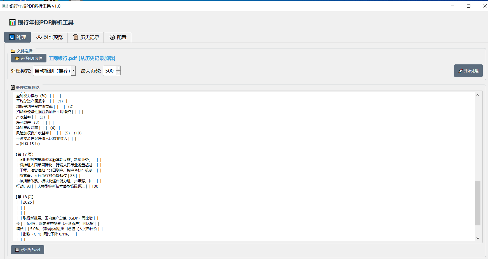
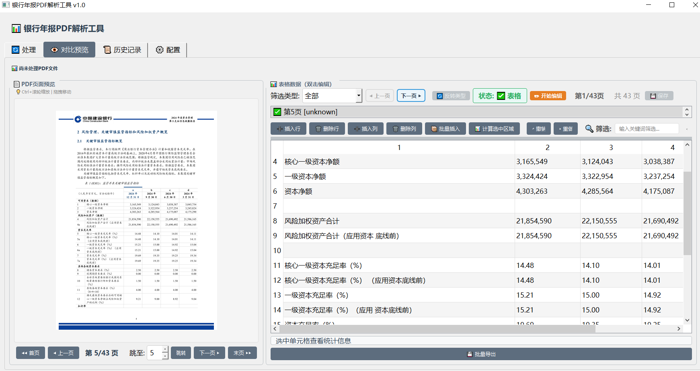
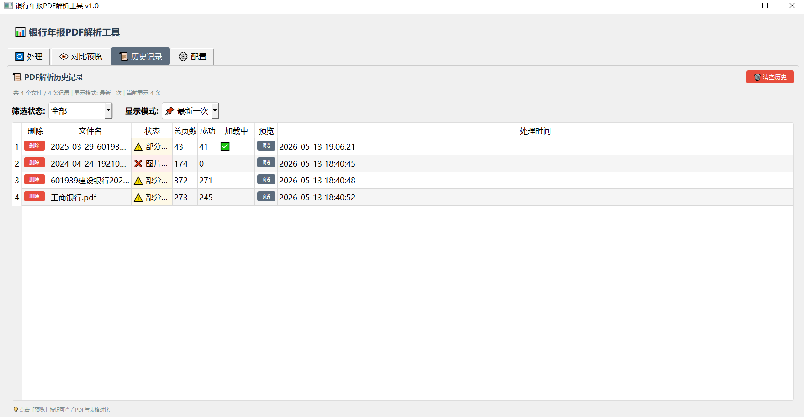

# DocuTable

> Author: 高玉伟 (Wills)

A desktop tool for extracting structured financial report tables from text-based PDFs, powered by PyQt5 and PyMuPDF.

## Features

- **Text-based PDF parsing** — Extract tables from native text PDFs using PyMuPDF coordinate-based layout analysis
- **PDF classification** — Automatically detect text-based vs scanned pages
- **Table structure preservation** — Maintains row/column boundaries and header alignment
- **Excel export** — One-click export to structured xlsx with multi-sheet support
- **Table comparison** — Side-by-side comparison of tables from different pages or documents
- **Data verification** — Built-in financial cross-verification rules for bank annual reports
- **Batch processing** — Process multi-page PDFs with page-level filtering

## 界面预览

### 1. PDF自动解析
支持文本型PDF和图片型PDF双模式解析，自动检测表格区域并提取数据。



### 2. 数据对比预览
PDF原图与提取的表格数据并排展示，支持页级筛选、单元格编辑和批量导出。



### 3. 解析历史记录
管理历史解析任务，支持状态筛选、重新加载和一键清理。



## Tech Stack

| Component | Technology |
|-----------|-----------|
| GUI Framework | PyQt5 |
| PDF Rendering | PyMuPDF (fitz) |
| Excel Export | openpyxl |
| External OCR | Volcano Engine Doubao API (optional) |

## Installation

```bash
pip install -r requirements.txt
```

## Usage

```bash
python main.py
```

## Project Structure

```
DocuTable/
├── codes/              # Core modules
│   ├── ui/             # PyQt5 UI components
│   ├── processor/     # PDF processing logic
│   └── config/         # Configuration
├── docs/               # Documentation
├── config/             # Local settings (not committed)
├── main.py             # Entry point
└── requirements.txt    # Dependencies
```

## Requirements

- Python 3.8+
- PyQt5 >= 5.15.0
- PyMuPDF >= 1.23.0
- openpyxl >= 3.1.0

## Author

高玉伟
