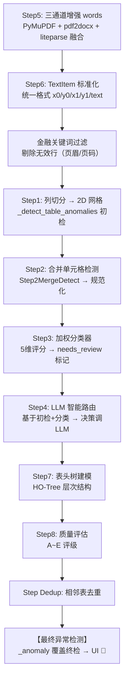
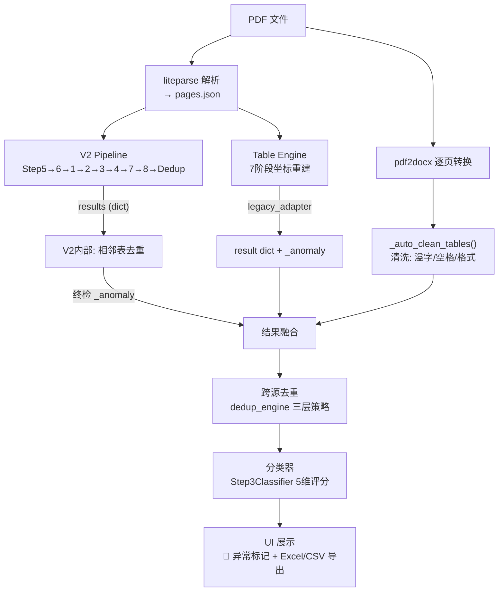

# DocuTable 项目架构要点梳理

> 日期：2026-07-17 · 分支 `dev/v2-optimize` · 文档版本 v2

---

## 1. 一句话定位

从金融年报 PDF 中**精确提取结构化表格数据**的桌面应用（PyQt5），双流水线架构：**V2 规则引擎**（文本型 PDF）+ **Table Engine 坐标驱动**（liteparse 单轨）。

---

## 2. 新人导航：从哪开始读

| 你想了解... | 入口文件 | 预计阅读时间 |
|------------|----------|:----------:|
| 一张 PDF 怎么变成表格的 | `processor.py:_ProcessingWorker.run()` (L5349) | 30 分钟 |
| V2 管线每一步在做什么 | `v2_steps/pipeline.py` → `_process_page()` (L170) | 20 分钟 |
| 坐标怎么驱动表格重建 | `table_engine/table_builder.py` → `pipeline.py` | 25 分钟 |
| 异常检测怎么判定 🔴 | `v2_steps/table_anomaly_rules.py` (12 条规则) | 15 分钟 |
| UI 怎么组织 8 个管理器 | `ui/main_window.py` | 20 分钟 |
| 两份 PDF 的表格怎么去重 | `table_validator/dedup_engine.py` | 20 分钟 |
| 怎么跑一个测试验证 | 根目录 `_test_v2_quick.py` / `_test_step1_anomaly_detect.py` | 5 分钟 |

---

## 3. 关键函数速查索引

| 函数/类 | 文件:行号 | 一句话用途 |
|----------|----------|-----------|
| `_ProcessingWorker.run()` | `codes/pdf_extractor/processor.py:5349` | 主编排入口，串联 pdf2docx → V2 → TE → 去重 → 导出 |
| `V2Pipeline.run()` | `codes/v2_steps/pipeline.py:70` | V2 规则引擎入口，调度 Step1~8+Dedup |
| `V2Pipeline._process_page()` | `codes/v2_steps/pipeline.py:170` | 单页处理编排：Step5→6→1→2→3→4→7→8 |
| `V2Pipeline._run_step4()` | `codes/v2_steps/pipeline.py:360` | LLM 智能路由，基于 Step1 异常初检 + Step3 分类决策 |
| `Step1ColumnSplit.split_table()` | `codes/v2_steps/step1_column_split.py:28` | 表格线感知列切分 → 2D 网格 |
| `Step1ColumnSplit._detect_table_anomalies()` | `codes/v2_steps/step1_column_split.py:867` | 异常检测薄代理 → `table_anomaly_rules.py` |
| `evaluate_table_issues()` | `codes/v2_steps/table_anomaly_rules.py` | 12 条规则全量检测（C01~C04 + R01~R09） |
| `issues_to_report()` | `codes/v2_steps/table_anomaly_rules.py:1078` | issue 列表 → `_anomaly` 字典 |
| `Step2MergeDetect.process()` | `codes/v2_steps/step2_merge_detect.py:19` | 合并单元格检测 → 规范化 |
| `Step3Classifier.classify()` | `codes/v2_steps/step3_classifier.py:135` | 5 维加权分类器 → `ClassifyResult` |
| `run_table_engine_segmentation()` | `codes/table_engine/integration/processor_bridge.py:24` | TE 分割入口：加载 liteparse → 分页建表 → legacy 格式 |
| `build_table_from_scope()` | `codes/table_engine/table_builder.py` | 单表构建：Y 聚类 → 网格推断 → Cell 矩阵 |
| `to_legacy_table()` | `codes/table_engine/export/legacy_adapter.py:44` | `StructuredTable` → 传统 `dict`（UI 消费） |
| `_auto_clean_tables()` | `codes/pdf_extractor/processor.py:5194` | 自动清洗：脱空格 → 删空行 → 合并断裂 |
| `dedup_adjacent()` | `codes/table_validator/dedup_engine.py:325` | 同页相邻表去重（A0/A1/A2 三层策略） |
| `_get_liteparse_page()` | `codes/pdf_extractor/processor.py:4579` | 从 liteparse 缓存按页号取数据 |

---

## 4. 整体分层架构

```
┌─────────────────────────────────────────────────────────────────┐
│  UI 层  (codes/ui/)                                             │
│  MainWindow → 8 个子 Manager                                     │
├─────────────────────────────────────────────────────────────────┤
│  编排层  (codes/pdf_extractor/)                                 │
│  _ProcessingWorker.run()                                        │
│  ├─ V2 Pipeline (文本型 PDF 主力)                                │
│  ├─ Table Engine (liteparse 坐标重建)                            │
│  ├─ VisionLLM / AI 纠错 (扫描件)                                 │
│  └─ ExcelExporter                                               │
├───────────────────────┬─────────────────────────────────────────┤
│  提取层                │  验证/修复层 (codes/table_validator/)    │
│  ├─ codes/v2_steps/    │  分类器 → LLM 修复 → 规则修复 →          │
│  │  V2 8+1 步规则管线  │  分割 → 去重 → 异常检测                  │
│  ├─ codes/table_engine/│                                          │
│  │  坐标驱动重建       │                                          │
│  └─ codes/liteparse_   │                                          │
│      extractor/        │                                          │
├───────────────────────┴─────────────────────────────────────────┤
│  辅助层                                                          │
│  codes/content_segmenter/  表/文区域分割                          │
│  codes/core/                早期遗留（已被替代）                    │
└─────────────────────────────────────────────────────────────────┘
```

### 4.1 顶级目录一览

| 目录 | 文件数 | 核心职责 |
|------|:-----:|---------|
| `codes/pdf_extractor/` | ~15 | **主编排层**：Processor、Worker、VisionLLM、Excel 导出 |
| `codes/v2_steps/` | 11 | **V2 规则引擎**：8+1 步流水线 + 配置 + 数据模型 |
| `codes/table_engine/` | 67 | **Table Engine**：坐标驱动表格重建（10 个子模块） |
| `codes/table_validator/` | 15 | **验证/修复/去重**：分类、LLM 修复、规则修复、异常检测 |
| `codes/ui/` | 12 | **GUI 层**：主窗口 + 8 大管理子系统 |
| `codes/liteparse_extractor/` | 7 | **liteparse 集成**：Rust PyO3 PDF 解析、缓存 |
| `codes/content_segmenter/` | 4 | **表/文分割**：X 方向离散度区分表格行/段落行 |
| `prompts/` | 3 | LLM Prompt 模板 |
| `docs/` | 11 | 架构/方案/进度文档 |

---

## 5. 双流水线深度剖析

### 5.1 V2 Pipeline（规则引擎，文本型 PDF 主力）

**入口**：`V2Pipeline.run()` → `_process_page()`，每步独立 `enable/disable`，失败不阻断流程。

**实际执行顺序**（按 `_process_page` 编排）：



**各步关键类/函数：**

| Step | 类/模块 | 文件 | 核心算法 |
|:----:|---------|------|---------|
| 1 | `Step1ColumnSplit` | `step1_column_split.py` | 表格线感知列切分 + `_detect_table_anomalies` 初检 |
| 2 | `Step2MergeDetect` | `step2_merge_detect.py` | 合并单元格检测 + 数据规范化 |
| 3 | `Step3Classifier` | `step3_classifier.py` | 5维加权评分（详见 §7.1） |
| 4 | `_run_step4()` | `pipeline.py:360` | LLM 路由：读取 `_anomaly` 初检 → 转换 reasons → 决策 |
| 5 | 内联 | `pipeline.py` | 三通道 words 融合（PyMuPDF/pdf2docx/liteparse） |
| 6 | 内联 | `pipeline.py` | TextItem 格式标准化 |
| 7 | 内联 | `pipeline.py` | 表头树 HO-Tree 建模 |
| 8 | 内联 | `pipeline.py` | 质量评估 A~E 评级 |
| Dedup | 内联 | `pipeline.py` | 相邻表去重 + 终检 `_anomaly` |

> **注意**：Step5→6→1 的编排顺序是先融合多通道 words 再做网格化，与直觉（先切分再融合）相反，这是有意设计：三通道融合后的 words 集合更完整，切分更准确。

### 5.2 Table Engine（坐标驱动，liteparse 单轨）

**入口**：`run_table_engine_segmentation()` → `processor_bridge.py:24`

**7 大处理阶段**（`table_engine/pipeline.py`）：

```mermaid
flowchart LR
    S0["Step 0: liteparse 加载<br/>source/liteparse_loader"] --> S1
    S1["Step 1: Y聚类+网格推断<br/>table_builder + geometry/"] --> S2
    S2["Step 2: Layout 插件选择<br/>layout/registry (9插件)"] --> S3
    S3["Step 3: Scope 边界确定<br/>scope/gap_capture + region_scope"] --> S4
    S4["Step 4: 表文分裂<br/>split/structure_split + table_text_split"] --> S5
    S5["Step 5: 内容划分去重<br/>split/content_partition"] --> S6
    S6["Step 6: 表头校验回补<br/>split/header_audit + scope/header_supplement"] --> S7
    S7["Step 7: Item 守恒校验<br/>conservation/item_conservation"] --> EXPORT
    EXPORT["Export: legacy_adapter<br/>StructuredTable → dict"]
```



#### 5.2.1 子模块文件级清单

**`split/`（表文分裂，13 文件）：**

| 文件 | 用途 |
|------|------|
| `row_classify.py` (~21KB) | 表行分类：值列指纹识别（empty/dash/numeric/date/text） |
| `structure_split.py` (~41KB) | 表内结构分裂：重复表头带检测 → 大表拆多个独立表 |
| `table_text_split.py` (~21KB) | StructuredTable → DocumentEntry 几何分裂 |
| `boundary_overlap.py` (~20KB) | 相邻表边界重叠检测与合并 |
| `content_partition.py` (~11KB) | TABLE/TEXT 互斥划分，基于转移语义去重不丢字 |
| `grid_prune.py` (~14KB) | 网格剪枝：删除整行/整列为空的网格线 |
| `trailing_header_reattach.py` (~12KB) | 表尾专检：叙述文本→TEXT，表头带校验后并入下一表 |
| `leading_header_reattach.py` (~6KB) | 表首缺表头回补：向上回溯并 prepend |
| `fragment_rejoin.py` (~6KB) | 误拆碎片重组：table + 节标题 + 续表 → 合并 |
| `footnote_strip.py` (~3KB) | 表尾脚注/注释行剥离 |
| `header_audit.py` (~2KB) | 表头带完整性校验 |
| `y_calibrate.py` (~2KB) | DocumentEntry Y 坐标校准 |

**`geometry/`（几何与网格，14 文件）：**

| 文件 | 用途 |
|------|------|
| `grid_infer.py` (~64KB) | 约束网格推断（CGR）核心：在 bbox 间"沟"里定列界，线不切字 |
| `row_refiner.py` (~51KB) | Y 聚类行精修：基于 text_item 坐标锁定数据行网格 |
| `cell_decomposition.py` (~23KB) | 统一单元格分解：多语义字段按列角色拆开 |
| `cell_numeric_repair.py` (~21KB) | 表体数值格校验与修复 |
| `cell_builder.py` (~19KB) | RowCluster → Cell 矩阵 → StructuredTable |
| `numeric.py` (~19KB) | 数值格判定：年份/日期/百分比等正则 |
| `column_anchors.py` (~15KB) | 列锚点系统：左对齐(x0)、右对齐(x1)、中心点 |
| `column_profile.py` (~12KB) | 列 profile + 行内角色约束 |
| `boundary_expand.py` (~9KB) | 表界向下扩展 |
| `data_column_assign.py` (~5KB) | 数值/破折号落列唯一入口 |
| `layout_rows.py` / `row_dict.py` / `item_bridge.py` | 行带筛选 / 聚类 dict / 格式桥接 |

**`scope/`（表区域边界，5 文件）：**

| 文件 | 用途 |
|------|------|
| `gap_capture.py` (~56KB) | 页内 region 间隙处理（最大文件）：表头剥离 + 说明文字捕获 |
| `header_scope.py` (~32KB) | 表头带识别与 scope 上扩（年报/字母/日期/人民币单位头等） |
| `header_supplement.py` (~18KB) | 表头完整性补充：gap 内遗漏行回补 |
| `region_scope.py` (~8KB) | 单表 scope 构建：region + pre_header + 向下扩展 |

**`layout/`（列布局插件体系，10 文件）：**

| 文件 | 用途 |
|------|------|
| `base.py` | `LayoutPlugin` Protocol 基类 |
| `registry.py` | 插件注册与选择（9 个插件按优先级尝试） |
| `constraint_grid.py` | 约束网格布局 |
| `generic.py` | 通用布局（fallback） |
| `pillar_cc1/cc2/ccrf/disclosure/dsib/gsib/sec1.py` | 第三支柱、DSIB、GSIB、SEC1 特殊表布局 |

**`export/`（输出与导出，3 文件）：**

| 文件 | 用途 |
|------|------|
| `legacy_adapter.py` | **唯一 `data[][]` 出口**：StructuredTable → 传统 dict |
| `cell_trace.py` | Cell → liteparse SourceItem 溯源 |
| `__init__.py` | 导出所有公共符号 |

**顶层文件（6 文件）：**

| 文件 | 用途 |
|------|------|
| `config.py` | `TableEngineConfig`：Y 容差(3.0pt)、scope 边距(10/30pt)、布局阈值(0.45) |
| `models.py` | 核心数据模型：BBox、SourceItem、RegionBox、StructuredTable、Cell 等 |
| `pipeline.py` | 全文档编排器：阅读顺序排序 + 去重 + 纯文本页构建 |
| `table_builder.py` | 单表构建入口：scope items 收集 → Y 聚类 → 网格推断 → Cell 构建 |
| `table_access.py` | 访问辅助：dense_rows / cell_text / find_row_index |

---

## 6. Processor 主流程（编排层汇聚点）

```
_ProcessingWorker.run()  (processor.py:5349)
  ├─ 1. pdf2docx 多进程逐页转换          (docx 产出)
  ├─ 2. V2Pipeline.run()                 (文本型 PDF: text+tables+paragraphs)
  ├─ 3. liteparse 加载/缓存              (liteparse_data)
  ├─ 4. _auto_clean_tables()             (清洗: 溢字/空格/格式修复)
  ├─ 5. Table Engine 建表分割            (覆盖 docx 表, 仅 native PDF)
  │      └─ 异常检测 → _anomaly           (liteparse text_items 做 words 源)
  ├─ 6. 去重: dedup_text_against_tables  (三层策略)
  ├─ 7. 分类器标记                       (is_real_table / quality_decision)
  ├─ 8. 页面类型标记                     (pure_table / mixed / pure_text)
  └─ 9. 导出 + 日志
```

**双轨策略**：
- **文本型 PDF**（可提取 word）：pdf2docx（表结构）+ V2 Pipeline（精提取）并行，结果融合
- **原生 PDF**（liteparse 单源）：Table Engine 坐标驱动重建，直接覆盖 docx 输出

---

## 7. 验证/修复/去重体系

### 7.1 分类器（`Step3Classifier`，`step3_classifier.py:120`）

5 维度加权评分，输出三态：

| 维度 | 权重 | 评分方式 |
|------|:---:|---------|
| 数值列比例 (`numeric_col_ratio`) | 0.30 | 含数值的列数 / 总列数 |
| 数据行数 (`data_rows`) | 0.20 | 有效数据行数归一化 |
| 列数量 (`column_count`) | 0.15 | 列数归一化 |
| 目录排除 (`toc_exclude`) | 0.15 | 目录页特征检测 → 低分惩罚 |
| 表头质量 (`header_quality`) | 0.20 | 表头文本结构质量评估 |

**加权总分**：`weighted_score = Σ(score[k] × weight[k])`

| weighted_score | 判定 |
|:---:|---|
| ≥ 0.65 | `is_real_table=True, needs_review=False` |
| 0.40 ~ 0.65 | `is_real_table=True, needs_review=True` |
| < 0.40 | `is_real_table=False, needs_review=False` |

### 7.2 去重引擎（`dedup_engine.py`）

**文本-表格去重**（三层策略）：

| Tier | 策略 | 原理 |
|:---:|------|------|
| 1 | item_index 精确差集 | liteparse item_index 对比，零误杀 |
| 2 | bbox 回退 | 段落无 item_index 时用 bbox 辅助 |
| 3 | token 重叠 | bbox 空间重叠 + token 内容重叠 |

**跨表去重**（5 个子策略）：

| 代号 | 策略 |
|:---:|------|
| A0 | 整表子集判定 |
| A1 | 表头碎片保护 |
| A2 | 孤立章节标题 |
| 尾头方向 + 结构完整性 | 方向+完整性双校验 |
| 碎片表双重防护 | 多维度冗余保护 |

### 7.3 规则修复（`table_structure_repair.py`）

`repair_and_split_tables()`：表头检测 → 数据起始定位 → 结构修复 → 子表分裂 → 去重

另有 V3 新模块（`table_block_decider.py`）：自适应阈值 + 集中分块 + 统一去重，代码已实现，待全面接入主流程。

### 7.4 异常检测体系（`table_anomaly_rules.py`，12 条规则）

**契约类规则（C01~C04）**：正常表必须满足的条件

| 规则ID | 名称 | 描述 |
|--------|------|------|
| `C01_missing_header` | 缺表头 | 数据列上方无表头文本 |
| `C02_unrecognized_data_row` | 无法识别数据行 | 数据区行归类失败（非数据行/折行/小节行/报告期行） |
| `C03_column_type_violation` | 列性质不一致 | 数值列出现文本、文本列出现独立数值 |
| `C04_incomplete_data_row` | 数据行不完整 | 数据行缺失高填充率数值列（填充率 ≥ 65%） |

**结构类规则（R01~R09）**：分列错位/粘连/丢失

| 规则ID | 名称 | 描述 |
|--------|------|------|
| `R01_orphan_extension` | 孤立片段 | 长文本列孤立片段无法接龙到锚点 |
| `R02_merged_in_short_col` | 短列吞并 | 短文本列吞并序号或邻列内容 |
| `R03_stacked_long_text` | 长文本粘连 | 单格含两段独立长文本（相邻行粘连） |
| `R04_merged_numeric` | 数值合并 | 数值格含多个独立数值 token |
| `R05_text_in_numeric` | 数值列含文本 | 数值列出现非法长文本，或短文本杂质超 12% |
| `R06_ghost_column` | 幽灵列 | 整列无数据但邻列有内容 |
| `R07_word_crosses_columns` | 跨列词 | 文本项横跨多列（基于 words + col_bounds） |
| `R08_header_data_misalign` | 表头数据错位 | 邻列表头与数据错位 |
| `R09_interior_singleton` | 内部碎片行 | 仅中间列有内容、其余全空 |

**评分与判定**：

```python
# anomaly_score: 质量类 issue 数 / 10，上限 1.0
anomaly_score = min(len(quality_issues) / 10.0, 1.0)

# needs_review: 确定性硬规则，命中任意一条非表头类规则即 True
needs_review = bool(quality_issues)
```

**双重执行机制**：

```
Step1 初检 ──→ Step4 LLM 路由（尽早决策）
     │
     └── (dedup 后覆盖)
           │
           └── 终检 _anomaly ──→ UI 🔴 标记（最准确）
```

| 路径 | 触发时机 | words 来源 | 用途 |
|------|---------|-----------|------|
| V2 Step1 初检 | 列切分后 | V2 自有三通道 words | Step4 LLM 路由输入 |
| V2 终检 | dedup 后 | V2 自有三通道 words（bbox 区域过滤） | UI 🔴 显示 |
| Table Engine 终检 | 建表+去重后 | `liteparse_data.text_items` | 主流程 🔴 显示 |

---

## 8. 数据流全景



---

## 9. 数据格式桥梁

```
liteparse parse_result  →  [pages].text_items  (坐标+文本)
V2 Pipeline            →  [dict](data/bbox/etc) (传统格式)
Table Engine           →  StructuredTable       (坐标类型)
legacy_adapter         →  dict(兼容 UI)         (转换层)
```

Table Engine 通过 `legacy_adapter.to_legacy_table()` 输出带 `x0/y0/x1/y1` + `_anomaly` 的字典，UI 读取 `table.get("_anomaly", {})` 显示 🔴。

---

## 10. UI 层结构

`main_window.py` 主窗口，包含 8 个子管理器：

| Manager | 职责 |
|---------|------|
| `FileManager` | 文件打开/拖放/历史 |
| `ProcessingManager` | 异步 Worker 调度（多线程） |
| `TableCompareManager` | 双表对比视图（原文 vs 提取） |
| `ExportManager` | CSV/Excel/JSON 导出 |
| `HistoryManager` | 历史 PDF 索引 + 缓存 |
| `PreviewManager` | PDF 页面预览渲染 |
| `SettingsManager` | 配置面板 |
| `TableEditor` | 单元格编辑（修正数据） |

辅助弹窗：`ai_correction_dialog.py`、`validation_dialog.py`

---

## 11. 配置体系

| 配置位置 | 用途 |
|----------|------|
| `codes/v2_steps/config.py` | V2 8+1 步默认参数（每步独立 CONFIG 字典 + JSON 覆盖） |
| `codes/table_engine/config.py` | `TableEngineConfig`：Y 容差(3.0pt)、scope 边距(10/30pt)、布局阈值(0.45) |
| `codes/table_validator/config.py` | 验证/修复参数：数值列占比阈值(0.70)、目录重复率阈值(0.60) |
| `codes/liteparse_extractor/config.py` | Liteparse 调用配置：密度网格 10×10、表格最小宽度比 0.3 |
| `prompts/system_prompt.txt` | LLM 系统提示词 |
| `prompts/financial_keywords.json` | 金融关键词词表 |

---

## 12. 关键技术决策

### 12.1 三源融合策略

| 源 | 场景 | 优势 |
|----|------|------|
| pdf2docx | 文本型 PDF | 表结构完整（行列+合并单元格） |
| liteparse | 原生 PDF | 坐标精准，每个词可溯源 |
| PyMuPDF | 提取 words | 坐标最精细，font 信息 |

### 12.2 Table Engine 三条铁律

1. **以终为始**：设计从用户最终结果倒推
2. **不为沉没成本买单**：旧代码迁移算法→验证→删除
3. **分步实施、步步可验**：每步含交付物+验证命令+通过标准+删除清单

### 12.3 liteparse 作为唯一坐标源

Table Engine 仅使用 liteparse 坐标（非 pdf2docx），因为：
- liteparse 坐标精准且每个词可溯源（`item_index`）
- 去重、校验、修复都依赖 `item_index` 精确对比
- pdf2docx 坐标精度不足，无法做词级定位

### 12.4 异常检测决策分离

- **Step4 LLM 路由**基于 Step1 初检结果（尽早决策，省 API 费用）
- **UI 🔴 标记**基于 dedup 后终检结果（最准确，匹配最终展示数据）
- 两者可能不一致：这是一个**预期行为**，因为初检的数据在 dedup 前、终检在 dedup 后

---

## 13. 测试体系

项目使用 `_test_*.py` 手写 `check()` 风格（无 pytest 依赖），根目录下积累 60+ 测试文件：

| 测试类别 | 代表文件 | 检查项 |
|---------|---------|:---:|
| V2 模块化 | `_test_v2_quick.py` | 37 |
| V2 Pipeline | `_test_v2_pipeline.py` | 5 页对比 |
| 异常检测 | `_test_step1_anomaly_detect.py` | 9 |
| Table Engine | `_test_te_step*.py` (8 个) | 各阶段验证 |
| 去重/脚注/合并 | `_test_step_dedup.py`, `_test_footnote_strip.py` 等 | 55+27 |

运行方式：`python _test_xxx.py`，输出 `X PASS / Y FAIL` 汇总。

---

## 14. 模块间调用关系矩阵

| 调用方 \ 被调用方 | V2 Steps | Table Engine | Validator | LiteparseExtractor | ContentSegmenter |
|:---|:---:|:---:|:---:|:---:|:---:|
| **Processor** | ✅ 主调用 | ✅ 主调用 | ✅ 分类/去重/修复 | ✅ 解析+缓存 | ✅ 表文分割 |
| **V2 Steps** | — | ❌ | ✅ 异常规则复用 | ❌ | ❌ |
| **Table Engine** | ❌ | — | ❌ | ✅ source 加载 | ✅ 布局分析 |
| **UI** | ❌ 只读 result dict | ❌ 只读 result dict | ❌ 读 classifier 结果 | ❌ | ❌ |

**设计原则**：
- V2 Steps 与 Table Engine **互不调用**，是两条独立流水线
- 两者只在 Processor 层汇聚（结果融合）
- Table Validator 被 Processor 和 V2 Steps 共同调用（异常规则复用）
- UI 层只消费最终 `dict` 结果，不直接依赖任何引擎

---

## 15. 当前状态与已知边界

| 项目 | 状态 | 说明 |
|------|:---:|------|
| V2 Steps 1~8 + Dedup | ✅ | 全部完成并接入 pipeline |
| Table Engine 7 阶段 | ✅ | 坐标驱动主路径可用 |
| 异常检测双路径 | ✅ | V2（初检+终检）+ Table Engine 均已挂接 |
| V3 自适应阈值/统一去重 | ⏸️ | 代码已实现，待全面接入主流程 |
| Table Engine 维度 5 精度 | ⏸️ | R07 跨列词检测因等宽网格反推精度有限，可在 legacy_adapter 输出真实 col_bounds |
| Step4 LLM 路由 vs UI 终检 | ⚠️ | 基于 Step1 初检，与 UI 终检可能不一致（预期行为） |
| V2 Step3 默认启用 | ⚠️ | `_enabled["step3"] = True`，但 `_test_v2_quick.py` 期望 `False`，测试需同步更新 |
| 单元测试覆盖率 | ⏸️ | `_detect_table_anomalies` 已补（9 项）；其余模块待扩展 |
| Table Engine layout 插件 | ✅ | 9 个插件覆盖通用+第三支柱+特殊表，按优先级匹配 |
